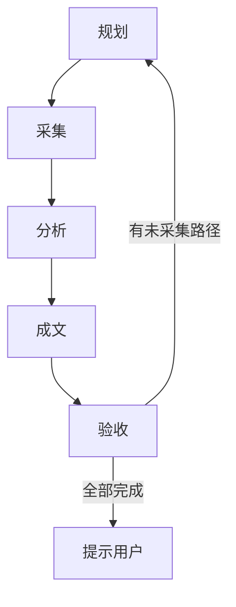
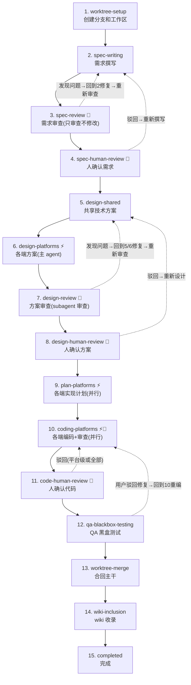

## 背景

AI当前的能力已经非常强大，探索AI为主体进行软件开发的能力.

在AI时代的软件开发流程与传统软件开发流程有非常大的差异,在AI时代，软件开发都应该以AI为主体，人类作为辅助与决策判断为主。

在传统软件开发公司中，我们拥有非常大的历史包袱，以及传统的工具链建设，我们也需要研究如何去兼容，频繁地切换到新的开发流程。

### WHY 红果

我们需要选择一个市面上相对比较有名，同时业务体量还不是那么大的产品。把功能的复杂度控制在中等，这样既能避免陷入过于复杂的业务逻辑，同时也能测试到，在面对相对复杂的业务场景下，AI能做到的极限。

红果是最近两年新出的产品，业务形态与产品架构相对来说都比较新，业务量也没有抖音那么的复杂。同时短剧行业也是当前热门的方向。


### 思路

这次实验主要是想验证过程与可行性，并不想验证其结果的准确性与质量，因为准确性与质量很大程度是由各端Harness工程决定的,而Harness工程并不在我们这次实验的范围内，所以这次实验重点关注AI native开发流程,在实现效果上我们只需要看大致的结果即可。并且在整个流程中，非必要情况下，人尽量避免参与。


这次实验的思路是，第一步让AI自主的去抓取红果应用的屏幕，并分析其业务逻辑，然后根据分析结果判断下一次抓取的内容。我们可以通过安卓模拟器与ADB命令来操控整个应用。第二步，将整理的业务逻辑整理成产品需求文档，然后每个需求进入开发流程，完成实现。其中第二步，为了兼容现在传统软件公司的组织架构，尽量保留现有的工作流程。


### 历程

简单的说一下整体的过程。

在开始的两天，我先做了一些简单的基础建设。比如工作流 skill，项目初始化等。
接下来一天，我让AI自动去抓取红果的页面，来分析其业务逻辑，并整理成文档。
最后4天,将整理出来的业务文档交给AI去规划并生成需求文档、技术文档，并且落地代码与测试。


### 工程项目设计

- .claude/ harness 工程
- `android/`：Android 应用代码与 Android 端专属说明
- `ios/`：iOS 应用代码与 iOS 端专属说明
- `web/`：Web 前端代码与前端专属说明
- `backend/`：后端服务代码与服务端专属说明
- `wiki/`：由 AI 维护的项目知识、背景信息与阶段性结论
- `docs/`：项目文档目录，包括需求、项目跟踪、设计记录、竞品分析等
- `docs/product_research/`：产品调研与竞品分析文档

### skill 设计
这里我们主要设计了以下几种skill。

#### 竞品调研 product research
竞品应用的**业务逻辑、交互行为、UI 样式**系统化地采集并整理为结构化文档。



#### 产品经理
product-manager 是「产品决策层」——在竞品调研（product-research）和开发落地（feature-workflow）之间，负责回答「下一步做什么、怎么做、做到哪了」。
product-research          product-manager           feature-workflow
(竞品调研)         →      (产品决策)        →       (开发落地)

| **路线规划** | 综合分析，输出功能优先级建议 | 用户提出新想法、阶段性复盘

#### 开发工作流

> TODO: 第一步流程图与第二步流程图。需要根据下面我的提示，帮我生成Nano Banana图片生成Prompt。放到Code Blocks中。

竞品调研流程：

进入页面，抓取屏幕，分析屏幕内容，落地分析文档。根据分析文档判断下一步抓取的目标，回到第一步。


简化版需求开发流程：

产品经理根据抓取文档，生成完整的PRD。
人控门（Human gate），审核需求文档。如果有问题，继续回到产品经理修改PRD。
根据PRD产出技术方案。
人控门（Human gate），审核技术方案，如果有问题，回到上一步修改技术方案。
前端、后端、iOS、安卓，根据任务开启并发subagent：
  生成Plan文档。轻量 TDD 实现计划
  coding
  生成subagent进行code review，如果有问题，返回Coding Agent继续修改。
Wiki收录与更新。应用所有信息，最终以Wiki为准。

参考：
| **需求撰写** | 查阅 wiki + 代码，撰写 spec | 主 agent | 
| **需求 Review** | 审查需求完整性/一致性/可行性 | subagent（循环修复） | 
| **技术方案设计** | Shared 设计 + 各端方案 | 主 agent 直接撰写 | 
| **技术方案 Review** | 审查设计完整性/一致性/跨端对齐（单 subagent） | subagent（循环修复，回到 writing） |
| **Plan 撰写** | 轻量 TDD 实现计划 | subagent（并行） | 
| **Coding** | 按 plan 逐步骤实现 | subagent（并行，内部含 code review） | 
| **Code Review** | 审查代码质量、规范、一致性（coding agent 直接并行派发专项 subagent） | coding agent 内联执行 | 
| **QA 黑盒测试** | 根据 spec 撰写测试文档，派发 subagent 执行黑盒测试（设备/模拟器方案预留） | 主 agent + subagent | 
| **Wiki 收录** | 汇总全流程产物 + git diff，委托 llm-wiki 更新 wiki | subagent | 




#### 各端开发harness

> 简单说一下功能，这一次简单设计了开发harness，不在本次实验范围内，可以放到下次聊

#### llm-wiki

LLM-wiki 是 agent 自身维护的项目全功能文档。

所有功能依据都来源于此，每次需求迭代也会持续更新并落地到wiki，形成循环

PRD 文档，技术方案设计等都需要根据 wiki 中的能力进行

记录内容：
api 文档
各端架构文档
业务、功能文档，包括功能描述，use case，各端技术方案
重要技术方案、业务逻辑决策文档

#### self-evolution

> 简单说明一下功能，不在本次实验范围内，可以放到下次聊

### 工具 & 模型

claude

gpt-5.4  200k
deepseek v4 pro 200k

没有使用最新最先进模型，模型的能力弱一些反而能更好的验证效果。

### 结果

> TODO：截图

```
┌───────────────────────────────────────────┬────────┬───────────────────────────┐
│ 分类                                      │ 行数   │ 文件数                    │
├───────────────────────────────────────────┼────────┼───────────────────────────┤
│ iOS Swift (ios/)                          │ 25,675 │ —                         │
├───────────────────────────────────────────┼────────┼───────────────────────────┤
│ Android Java + Kotlin (android/)          │ 31,683 │ 288（全部为 .kt，无       │
│                                           │        │ .java）                   │
├───────────────────────────────────────────┼────────┼───────────────────────────┤
│ Backend JS + TS (backend/)                │ 18,536 │ 159（全部为 .ts，无 .js） │
├───────────────────────────────────────────┼────────┼───────────────────────────┤
│ Web JS + TS + TSX + CSS + HTML + MJS      │ 11,139 │ —                         │
│ (web/)                                    │        │                           │
├───────────────────────────────────────────┼────────┼───────────────────────────┤
│ Wiki MD (wiki/)                           │ 7,471  │ 57                        │
└───────────────────────────────────────────┴────────┴───────────────────────────┘
```

在本次实验过程中，需求相关人控门几乎没有进行修改，所以可以认为本次所有流程都是ai自主生成的，人只是做了一些流程上的控制。


### 感受

真的需要让 ai 把整个工作流程重新做一遍。

#### 人的职责转变

写代码已经不是门槛，目前的门槛都是历史问题。

人的职责

#### 人工瓶颈


从DDD，单侧范围：entity -> repository -> usercase -> viewmodel

review：coding 质量问题，弱模型已经非常高


## 架构

### 整体

效率优化需要从整体上进行
coding 只占用很小一部分
需求，数据，UG，feedback，abtest，监控

### 架构设计

文件路径

流程，工作留痕
现实场景不是完成某个功能，而是按照我的设计和方案完成某个功能，哪怕我的功能不是最优的。

需求管理

知识库

意外之喜： 六边形架构 The clean arch，中心化DI系统设计缺陷


### skill 设计

why not superpowers

#### workflow

并发与编排
让 ai 做完所有的工作 vs 每次让 ai 做一件事情，从需求到各端开发

#### wiki


#### self-evolution

决策记录很有用

用户纠正  错误解决 重复工作流

#### backend/frontend/ios/android dev skill

## 遇到的问题

流程破坏

目标漂移

职责范围限定，修改了不应该修改的内容，访问了不应该访问的数据

合并冲突，修改了内容
每个需求1w+行代码修改

compact 导致的遗忘

## 经验

harness -> loop engineering -> graph

### 资产沉淀

查询成本

### 复杂业务的迭代开发

并发 or 顺序

### 模型 Context Length

### 是否需要 subagent

### 对抗与review

### 专家团队

### 流程固化

新需求

bugfix

uifix

ab实验

### 脚本 & 代码 代替 ai

### 中间产物

### claude subagent / agent team

context 隔离
prompt 隔离
mcp/skill 隔离
cwd 隔离

常驻subagent

### dev-loop

验证3层结构
build/lint
tests
review

### human in the loop

### TDD

### Debug Tools

env
AUTH mock
deeplink goto
动态数据验证，比如网络
模块化，DI 变的更为重要

### Logger

日志过滤
日志堆栈
上下文传播，并发任务，日志重叠
日志多端统一的格式与语义

### UI Test

测试用例集

构建测试mock专用数据集及其框架

### 黑盒测试

测试用例管理
混沌测试

### 模块拆分

### DI 还是 组合


### 优化：持续学习

量化，skill 调用次数，有效性等
会话历史持久化
dataset

meta dev，元更新不能使用skill等

本地，远端，离线计算

会话 -> 审查 -> 优化

### 成本优化

### 记忆优化


### prompt/skill 优化

手动
自动 GAN planner-generator-evaluator
```
                    ┌─────────────┐
                    │   PLANNER   │
                    │  (Opus 4.6) │
                    └──────┬──────┘
                           │ 产品规格
                           │ (功能、sprint、设计方向)
                           ▼
              ┌────────────────────────┐
              │                        │
              │   GENERATOR-EVALUATOR  │
              │      FEEDBACK LOOP     │
              │                        │
              │  ┌──────────┐          │
              │  │GENERATOR │--build-->│──┐
              │  │(Opus 4.6)│          │  │
              │  └────▲─────┘          │  │
              │       │                │  │ live app
              │    feedback             │  │
              │       │                │  │
              │  ┌────┴─────┐          │  │
              │  │EVALUATOR │<-test----│──┘
              │  │(Opus 4.6)│          │
              │  │+Playwright│         │
              │  └──────────┘          │
              │                        │
              │   5-15 iterations      │
              └────────────────────────┘
```

### Memory

会话级 - 需求级 - 项目模块 - 项目级 - 公司级

llm wiki

### LLM wiki

### CodeGraph

### CI/CD

### 云端

agent，架构
并发，多实例
云端文件系统
设备上云
metric
结构化日志

### A2A？

### 需求变更

### Delegate 主 agent

### 讨论是否遵循历史软件开发工作流？

### loop / graph engineering

claude code dynamic workflow

### eval

## 新时代组织的探讨

## Agent 选择

### Claude

最优秀
闭源，定制能力差，后门风险

### Codex

### PI

自定义，扩展性，架构设计的真棒

LLM 不稳定性 比如 review-loop
subagent 指定 cwd，skills，mcp，tools，model 等
举例：iOS，Android coding agent

### OpenCode

云端，分布式系统


## 总结
